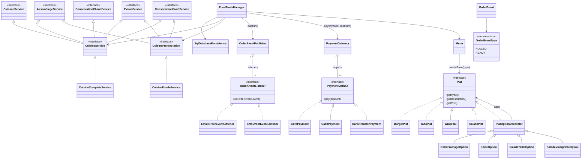

# Diagramme UML (Mermaid)

```mermaid
classDiagram

%% =========================
%% Noyau
%% =========================
class FoodTruckManager
class SqlDatabasePersistence
class CuisineService {
  <<interface>>
}
class CuisineFroideStation {
  <<interface>>
}
class CuissonService {
  <<interface>>
}
class AssemblageService {
  <<interface>>
}
class ExtrasService {
  <<interface>>
}
class ConservationFroidService {
  <<interface>>
}
class ConservationChaudService {
  <<interface>>
}

class CuisineCompleteService
class CuisineFroideService

FoodTruckManager --> SqlDatabasePersistence
FoodTruckManager --> CuisineService
FoodTruckManager --> CuisineFroideStation

CuisineService <|.. CuisineCompleteService
CuisineFroideStation <|.. CuisineFroideService

CuissonService <|-- CuisineService
AssemblageService <|-- CuisineService
ExtrasService <|-- CuisineService
ConservationFroidService <|-- CuisineService
ConservationChaudService <|-- CuisineService

AssemblageService <|-- CuisineFroideStation
ExtrasService <|-- CuisineFroideStation
ConservationFroidService <|-- CuisineFroideStation

%% =========================
%% Notification (Observer)
%% =========================
class OrderEventPublisher
class OrderEvent
class OrderEventType {
  <<enumeration>>
  PLACED
  READY
}
class OrderEventListener {
  <<interface>>
  +onOrderEvent(event)
}
class EmailOrderEventListener
class SmsOrderEventListener

FoodTruckManager --> OrderEventPublisher : publish()
OrderEventPublisher "1" o-- "0..*" OrderEventListener : listeners
OrderEventListener <|.. EmailOrderEventListener
OrderEventListener <|.. SmsOrderEventListener
OrderEvent --> OrderEventType

%% =========================
%% Paiement (Strategy)
%% =========================
class PaymentGateway
class PaymentMethod {
  <<interface>>
  +pay(amount)
}
class CardPayment
class CashPayment
class BankTransferPayment

FoodTruckManager --> PaymentGateway : payer(mode, montant)
PaymentGateway "1" o-- "0..*" PaymentMethod : registre
PaymentMethod <|.. CardPayment
PaymentMethod <|.. CashPayment
PaymentMethod <|.. BankTransferPayment

%% =========================
%% Menu / Options (Decorator)
%% =========================
class Menu
class Plat {
  <<interface>>
  +getType()
  +getDescription()
  +getPrix()
}
class PlatOptionDecorator
class ExtraFromageOption
class EpiceOption
class SaladeTailleOption
class SaladeVinaigretteOption

class BurgerPlat
class TacoPlat
class WrapPlat
class SaladePlat

FoodTruckManager --> Menu
Menu --> Plat : createBase(type)

Plat <|.. BurgerPlat
Plat <|.. TacoPlat
Plat <|.. WrapPlat
Plat <|.. SaladePlat

Plat <|.. PlatOptionDecorator
PlatOptionDecorator --> Plat : base

PlatOptionDecorator <|-- ExtraFromageOption
PlatOptionDecorator <|-- EpiceOption
PlatOptionDecorator <|-- SaladeTailleOption
PlatOptionDecorator <|-- SaladeVinaigretteOption
```